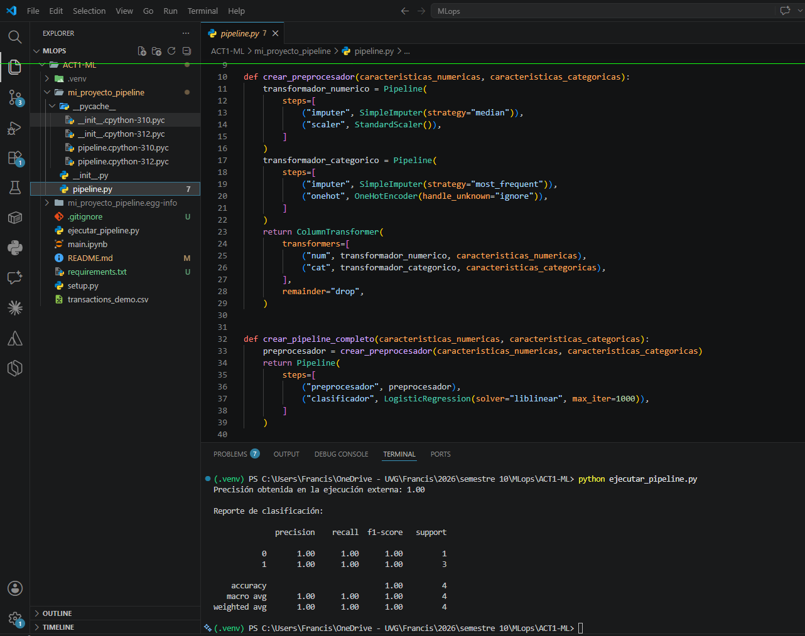

# ACT1-ML — Pipeline de clasificación con Scikit-learn

Actividad #1 del curso de MLOps. El proyecto diseña un pipeline de Scikit-learn
(imputación → escalado / one-hot → regresión logística) y lo **empaqueta** como un
módulo Python reutilizable, de modo que cualquier persona pueda instalarlo y
ejecutarlo en otra computadora sin reescribir el código.

**Integrantes**

| Nombre | Carné |
| --- | --- |
| Paula Barillas | 22764 |
| Gerardo Pineda | 22880 |
| Mónica Salvatierra | 22249 |
| Bianca Calderón | 22272 |
| Francis Aguilar | 22243 |
| José Marchena | 22398 |

Repositorio: <https://github.com/paulabaal12/ACT1-ML>

---
## Captura de pantalla de compañero B 


---
## Estructura del repositorio

```
ACT1-ML/
├── mi_proyecto_pipeline/       # Paquete instalable con la lógica del pipeline
│   ├── __init__.py             # Expone crear_pipeline_completo y entrenar_y_evaluar
│   └── pipeline.py             # Preprocesador + pipeline + entrenamiento/evaluación
├── ejecutar_pipeline.py        # Script de demostración (simula otra computadora)
├── transactions_demo.csv       # Dataset de ejemplo, 20 filas, incluido en el repo
├── main.ipynb                  # Notebook con el desarrollo completo (CRISP-DM)
├── setup.py                    # Metadatos de instalación del paquete
├── requirements.txt            # Dependencias
└── README.md
```

### Qué hace cada pieza

- **`mi_proyecto_pipeline/pipeline.py`** — el corazón del proyecto. Tres funciones:
  - `crear_preprocesador(num, cat)`: `ColumnTransformer` que imputa numéricas con la
    mediana y las escala con `StandardScaler`; imputa categóricas con la moda y las
    codifica con `OneHotEncoder(handle_unknown="ignore")`.
  - `crear_pipeline_completo(num, cat)`: encadena el preprocesador con una
    `LogisticRegression(solver="liblinear", max_iter=1000)`.
  - `entrenar_y_evaluar(df, target_column, test_size=0.2, random_state=42)`: detecta
    automáticamente qué columnas son numéricas y cuáles categóricas, hace el
    `train_test_split`, entrena y devuelve `(pipeline, accuracy, report)`.
- **`ejecutar_pipeline.py`** — importa el paquete, carga `transactions_demo.csv` e
  imprime la precisión y el reporte de clasificación. Es la demostración de que el
  pipeline corre fuera del notebook.
- **`main.ipynb`** — el desarrollo paso a paso con las etapas de CRISP-DM
  (*Business Understanding* y *Data Understanding*), el diagrama del pipeline y la
  justificación del empaquetado.

---

## Requisitos previos

- **Python 3.9 o superior** (probado con 3.12.10)
- `pip`

Verificá tu versión:

```bash
python --version
```

> En algunos sistemas el comando es `python3` en lugar de `python`. Usá el que te funcione
> y aplicá el mismo en todos los pasos siguientes.

---

## Pasos para ejecutar

### 1. Clonar el repositorio

```bash
git clone https://github.com/paulabaal12/ACT1-ML.git
cd ACT1-ML
```

### 2. Crear y activar un entorno virtual

Esto aísla las dependencias del proyecto de tu instalación global de Python.

**Windows (PowerShell):**

```powershell
python -m venv .venv
.\.venv\Scripts\Activate.ps1
```

Si PowerShell bloquea el script de activación, ejecutá una sola vez:

```powershell
Set-ExecutionPolicy -Scope Process -ExecutionPolicy Bypass
```

**Linux / macOS:**

```bash
python3 -m venv .venv
source .venv/bin/activate
```

Sabés que funcionó porque el prompt de la terminal empieza con `(.venv)`.

### 3. Instalar las dependencias

```bash
pip install -r requirements.txt
```

### 4. Instalar el paquete en modo editable

Este es el paso que hace que `import mi_proyecto_pipeline` funcione desde cualquier
carpeta, sin necesidad de manipular `sys.path`:

```bash
pip install -e .
```

> **Alternativa sin instalar:** si no querés instalar el paquete, podés ejecutar el
> script directamente desde la carpeta `ACT1-ML/`; Python encuentra el paquete porque
> está en el mismo directorio. La instalación con `-e .` es la forma recomendada
> porque es la que replica lo que haría un compañero en otra máquina.

### 5. Ejecutar el pipeline

```bash
python ejecutar_pipeline.py
```

**Salida esperada:**

```
Precisión obtenida en la ejecución externa: 1.00

Reporte de clasificación:

              precision    recall  f1-score   support

           0       1.00      1.00      1.00         1
           1       1.00      1.00      1.00         3

    accuracy                           1.00         4
   macro avg       1.00      1.00      1.00         4
weighted avg       1.00      1.00      1.00         4
```

Si ves esa salida, el pipeline quedó instalado y funcionando correctamente.

---

## Uso del paquete desde tu propio código

Una vez instalado, podés usar el pipeline con cualquier DataFrame:

```python
import pandas as pd
from mi_proyecto_pipeline import entrenar_y_evaluar

df = pd.read_csv("mis_datos.csv")
pipeline, accuracy, report = entrenar_y_evaluar(df, target_column="mi_columna_objetivo")

print(f"Precisión: {accuracy:.2f}")
print(report)
```

La función detecta sola qué columnas son numéricas y cuáles categóricas, así que no
hace falta declararlas. También podés construir el pipeline sin entrenarlo:

```python
from mi_proyecto_pipeline import crear_pipeline_completo

pipeline = crear_pipeline_completo(
    caracteristicas_numericas=["monto", "edad"],
    caracteristicas_categoricas=["ciudad", "categoria"],
)
pipeline.fit(X_train, y_train)
```

---

## Ejecutar el notebook (`main.ipynb`)

Con el entorno virtual activado y las dependencias instaladas:

```bash
jupyter notebook main.ipynb
```

O abrilo directamente en VS Code seleccionando `.venv` como kernel.

⚠️ **Dos advertencias importantes sobre el notebook:**

1. **El notebook no corre completo tal como está.** La celda de carga de datos hace
   `pd.read_csv('/content/transactions.csv')`, que es una ruta de **Google Colab**, y
   el archivo `transactions.csv` (1,000 transacciones UPI) **no está incluido en este
   repositorio**. Las celdas ya traen sus salidas guardadas, así que se puede leer el
   análisis completo sin ejecutarlo. Para correrlo de verdad tenés dos opciones:
   - Abrirlo en Google Colab y subir `transactions.csv` a `/content/`, o
   - Colocar `transactions.csv` junto al notebook y cambiar esa línea por
     `pd.read_csv('transactions.csv')`.
2. **Las últimas dos celdas (secciones 9 y 10) sí corren localmente**, porque usan
   `transactions_demo.csv`, que sí está en el repo. Son las que demuestran el
   empaquetado. Requieren que el notebook se ejecute desde la carpeta `ACT1-ML/`.

---

## Notas sobre los resultados

- **`transactions_demo.csv` es un dataset de juguete de 20 filas** creado para probar
  el empaquetado, no para obtener un modelo útil. Con un `test_size=0.2` el conjunto
  de prueba queda en **4 filas**, así que la precisión de 1.00 no es señal de un buen
  modelo.
- Además, `entrenar_y_evaluar` solo excluye la columna objetivo, por lo que
  `Amount (INR)` se queda como variable predictora — y `is_large_transaction` se
  derivó justamente de ese monto. Eso es **fuga de información (data leakage)**: el
  modelo ve la respuesta. Es la razón real del 1.00. Si querés una evaluación honesta,
  eliminá la columna del monto antes de llamar a la función:

  ```python
  df_sin_fuga = df.drop(columns=["Amount (INR)"])
  _, accuracy, report = entrenar_y_evaluar(df_sin_fuga, target_column="is_large_transaction")
  ```

- En el notebook, con el dataset real de 1,000 filas y sin el monto como feature, la
  precisión baja a **0.44** — el resultado esperable, dado que las columnas restantes
  (IDs, nombres, timestamps) son identificadores casi únicos y no tienen poder
  predictivo real sobre el tamaño de la transacción.

---

## Solución de problemas

| Problema | Causa y solución |
| --- | --- |
| `ModuleNotFoundError: No module named 'mi_proyecto_pipeline'` | No corriste `pip install -e .`, o lo corriste fuera del entorno virtual. Reactivá el venv y repetí el paso 4. |
| `ModuleNotFoundError: No module named 'sklearn'` | Falta instalar dependencias: `pip install -r requirements.txt`. |
| `FileNotFoundError: transactions_demo.csv` | Estás ejecutando desde otra carpeta. `cd` a `ACT1-ML/` primero. (El script `ejecutar_pipeline.py` resuelve la ruta solo, pero el notebook no.) |
| `FileNotFoundError: /content/transactions.csv` | Es la ruta de Colab en el notebook. Ver la advertencia de la sección anterior. |
| PowerShell: `no se puede cargar el archivo Activate.ps1` | Ejecutá `Set-ExecutionPolicy -Scope Process -ExecutionPolicy Bypass` y volvé a activar. |
| `ConvergenceWarning` de scikit-learn | Es una advertencia, no un error. El modelo igual se entrena y el resultado es válido. |
